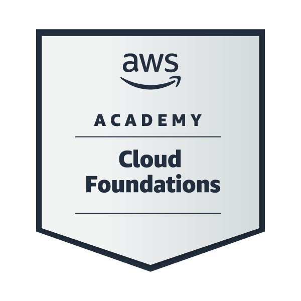
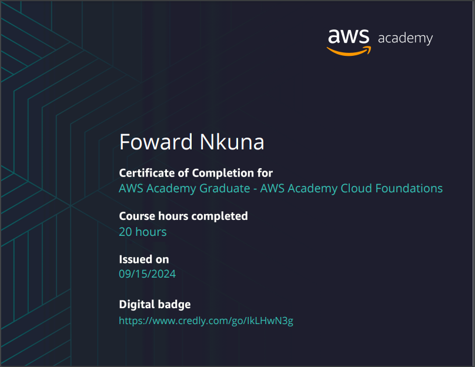

# SOFTWARE DEVELOPER

## 🧰 Languages and Tools

  
  
  
  
  
  
  
  
  
  
  
  
  
  
  
  
  

   
 

---

- 👀 I’m interested in teamwork and am ready to learn more to gain experience.
- 🌱 I’m currently studying computer science.
- 💞️ I’m looking to collaborate on creating web, Android, and desktop applications.
- 📫 How to reach me: [WhatsApp](tel:+0640693714).

---

Feel free to connect with me! I'm always open to collaboration and new opportunities.

## Certifications

  
  

## GitHub Stats

        
<!---
FowardPro/FowardPro is a ✨ special ✨ repository because its `README.md` (this file) appears on your GitHub profile.
You can click the Preview link to take a look at your changes.
--->
